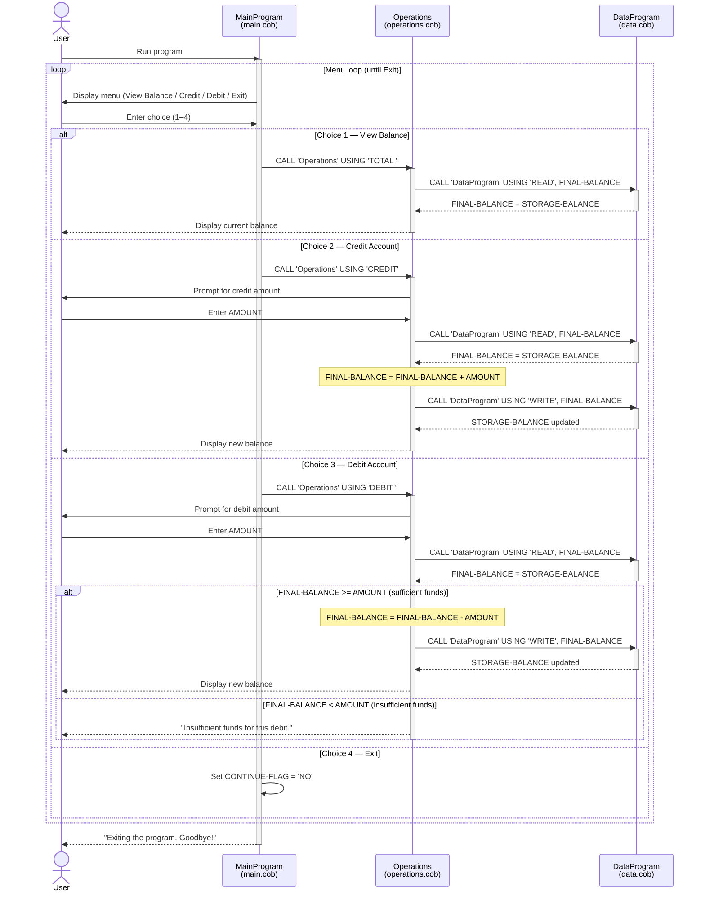

# Student Account Management System — COBOL Documentation

This document describes the legacy COBOL codebase that implements a simple student account management system. The system supports viewing a balance, crediting funds, and debiting funds from a single account.

---

## File Overview

| File | Program ID | Role |
|------|------------|------|
| `src/cobol/main.cob` | `MainProgram` | Entry point; displays menu and routes user input |
| `src/cobol/operations.cob` | `Operations` | Business logic for account operations |
| `src/cobol/data.cob` | `DataProgram` | In-memory data layer; reads and writes the account balance |

---

## File Details

### `main.cob` — Entry Point

**Program ID:** `MainProgram`

Presents an interactive text menu to the user and delegates to the `Operations` program based on the selection.

**Menu options:**

| Choice | Action | Operation code passed |
|--------|--------|-----------------------|
| 1 | View balance | `TOTAL ` |
| 2 | Credit account | `CREDIT` |
| 3 | Debit account | `DEBIT ` |
| 4 | Exit | sets `CONTINUE-FLAG` to `NO` |

**Key variables:**

- `USER-CHOICE` (`PIC 9`) — stores the menu selection entered by the user.
- `CONTINUE-FLAG` (`PIC X(3)`) — loop control; loop exits when set to `NO`.

**Control flow:** Loops via `PERFORM UNTIL CONTINUE-FLAG = 'NO'`, evaluating each menu choice and calling `Operations` with the appropriate 6-character operation code.

---

### `operations.cob` — Business Logic

**Program ID:** `Operations`

Receives a 6-character operation code from `MainProgram` and carries out the corresponding account operation by delegating data access to `DataProgram`.

**Operations:**

| Operation code | Description |
|----------------|-------------|
| `TOTAL ` | Reads the current balance from `DataProgram` and displays it. |
| `CREDIT` | Prompts for an amount, reads the current balance, adds the amount, and writes the new balance back. |
| `DEBIT ` | Prompts for an amount, reads the current balance, and subtracts the amount only if funds are sufficient; otherwise displays an insufficient funds message. |

**Key variables:**

- `OPERATION-TYPE` (`PIC X(6)`) — local copy of the operation code passed in.
- `AMOUNT` (`PIC 9(6)V99`) — the credit or debit amount entered by the user.
- `FINAL-BALANCE` (`PIC 9(6)V99`) — working copy of the account balance during an operation.

**Business rules:**

- **Minimum balance / overdraft protection:** A debit is only processed when `FINAL-BALANCE >= AMOUNT`. If the account has insufficient funds the transaction is rejected with the message `"Insufficient funds for this debit."` and the balance is unchanged.
- **No negative amounts validation:** The system does not explicitly validate that the entered amount is positive; inputs are accepted as-is from the user.
- **Initial default balance:** `FINAL-BALANCE` is initialised to `1000.00`. This value is overwritten on every operation by a `READ` call to `DataProgram`, so the working-storage default only matters before the first `READ`.

---

### `data.cob` — Data Layer

**Program ID:** `DataProgram`

Acts as a simple in-memory data store for the account balance. It is called with a 6-character operation code and a balance variable passed by reference.

**Operations:**

| Operation code | Description |
|----------------|-------------|
| `READ  ` | Copies the internal `STORAGE-BALANCE` into the caller's `BALANCE` variable. |
| `WRITE ` | Copies the caller's `BALANCE` value into `STORAGE-BALANCE`, persisting it for the session. |

**Key variables:**

- `STORAGE-BALANCE` (`PIC 9(6)V99`) — the in-memory authoritative balance; initialised to `1000.00`.
- `PASSED-OPERATION` (`PIC X(6)`) — operation code received from the caller via the `LINKAGE SECTION`.
- `BALANCE` (`PIC 9(6)V99`) — the balance variable shared with the calling program via the `LINKAGE SECTION`.

**Business rules:**

- **Starting balance:** Every program run begins with a balance of `1000.00`. There is no persistent file or database storage; all changes are lost when the process exits.
- **Balance field size:** `PIC 9(6)V99` supports values from `0.00` up to `999999.99`. Amounts exceeding this range would cause numeric overflow.

---

## Call Hierarchy

```
MainProgram  (main.cob)
    └── CALL 'Operations'  (operations.cob)
            ├── CALL 'DataProgram' USING 'READ'   (data.cob)
            └── CALL 'DataProgram' USING 'WRITE'  (data.cob)
```

---

## Business Rules Summary

| Rule | Location | Detail |
|------|----------|--------|
| Default starting balance | `data.cob` | Account opens at `1000.00` each session |
| Overdraft protection | `operations.cob` | Debits are blocked when `AMOUNT > FINAL-BALANCE` |
| Balance precision | `data.cob`, `operations.cob` | Two decimal places; max value `999999.99` |
| Session-only persistence | `data.cob` | Balance is stored in working storage only; not written to disk |
| Input routing | `main.cob` | Invalid menu choices (not 1–4) display an error and re-prompt |

---

## Data Flow Sequence Diagram


